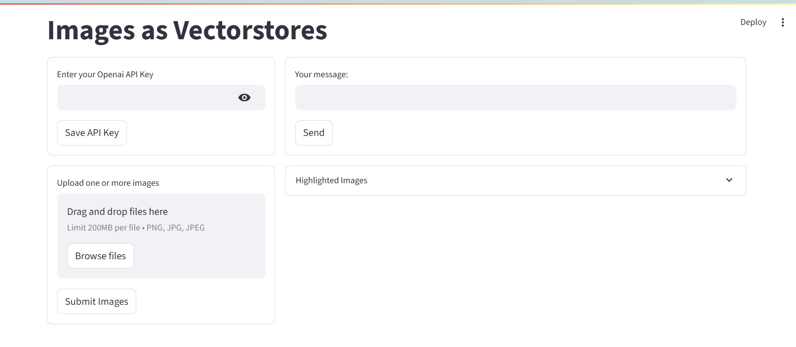
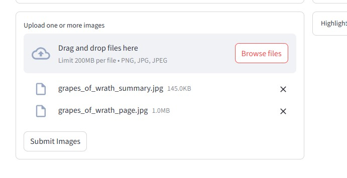
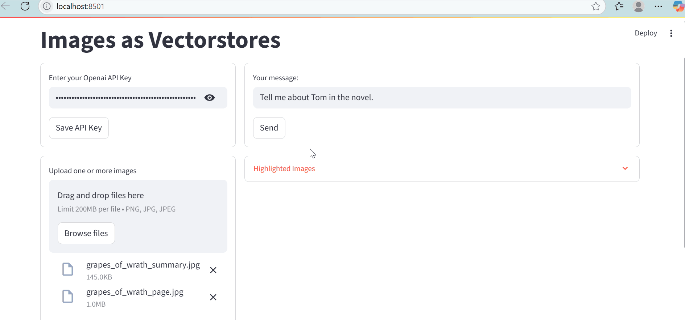
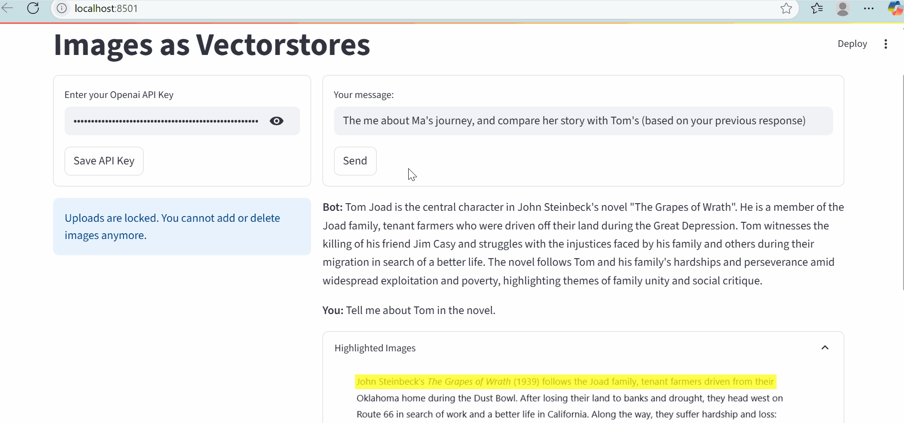

# Talk To Images
**Note**: This repository is just a Readme and image files that describe a private repo that I have uploaded. A demo may be available upon request.
### Overview
Talk To Images is a web application that lets users interact with the text content of an image.
Users can upload an image containing text, ask questions about the text in natural language, and receive both an answer and a version of the image with the relevant text highlighted.

This combines Optical Character Recognition (OCR) with a conversational AI agent to make interacting with image-based text intuitive and useful — for example, extracting specific details, summarizing content, or locating key information.

### Demo
For this walkthrough, I will be using images regarding John Steinbeck's Grapes of Wrath. One image is of a page from my physical copy of the novel. The second is screenshot of an llm generated summary of the book.

#### UI
The UI contains 4 core elements: 
- API Submission: Submit the openai api key to power the agent
- Image Upload: Upload images to provide context to the agent
- Textbox: Ask the agent questions
- Highighted Images: Highlighted images to show where the agent got their answers.

#### Image upload

#### Interacting with the chatbot
*Query 1: Tell me about Tom in the novel.*

*Query 2: Tell me about Ma's journey, and compare her story with Tom's (Based on your previous response).*

*Query 3: What did Tom hand to Al? Also, who died first among the family?*

### How It Works
The application consists of three main components:

1. Text Extraction
  When an image is uploaded, the application uses EasyOCR, an open-source OCR library, to detect and extract text.
  
    EasyOCR returns both:
    
    - The text content, split into logical chunks.
    
    - The bounding box coordinates of each chunk in the image.
  
  This allows the system to later map answers back to specific areas of the image for highlighting. This information
  is stored in a vectorDB for future RAG operations.

2. Conversational Agent
  The agent understands the query, and invokes the RAG tool with different variations
  of the query. With this, the text context and bounding box coordinates are retrieved,
  allowing the agent to answer the user query, and highlight the image.

3. Visual Highlighting
  Once the agent identifies the relevant text chunks that answer the query, the application highlights the corresponding regions on the image.
